# Capítulo 4: Solution Software Design #

## _4.1. Strategic-Level Domain Driven Design_ ##

Para entender el dominio y sus límites, utilizamos la técnica de Event Storming. Esta técnica nos permite descubrir los eventos clave del dominio, identificar los actores involucrados y definir los contextos delimitados (bounded contexts) que conforman el sistema.

### 4.1.1. Event Storming ###

El equipo uso la herramienta Miro para llevar a cabo sesiones de Event Storming. A continuación, se presentan los pasos seguidos y los resultados obtenidos en cada fase del proceso:

## Paso 1: Collect Domain Events

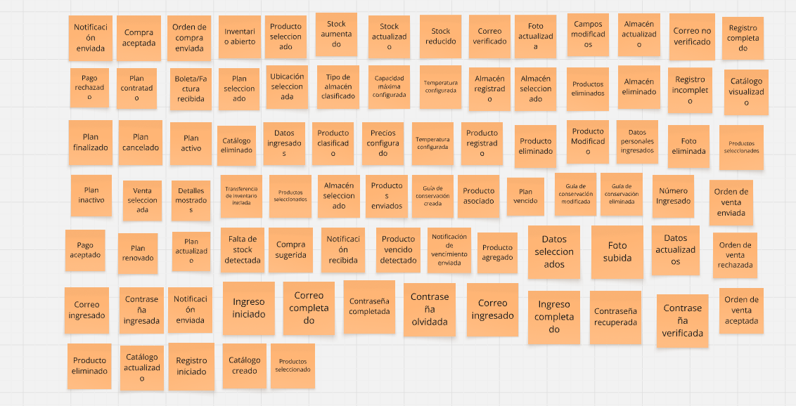

## Paso 2: Timelines

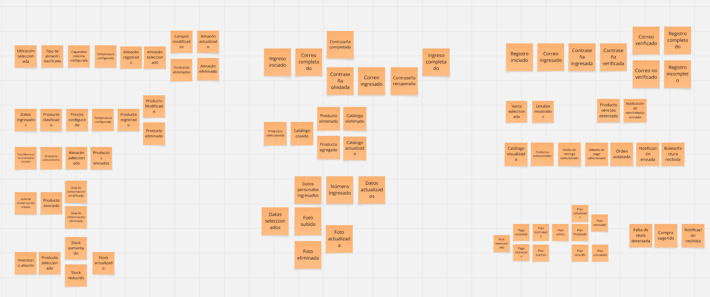

## Paso 3: Pain Points

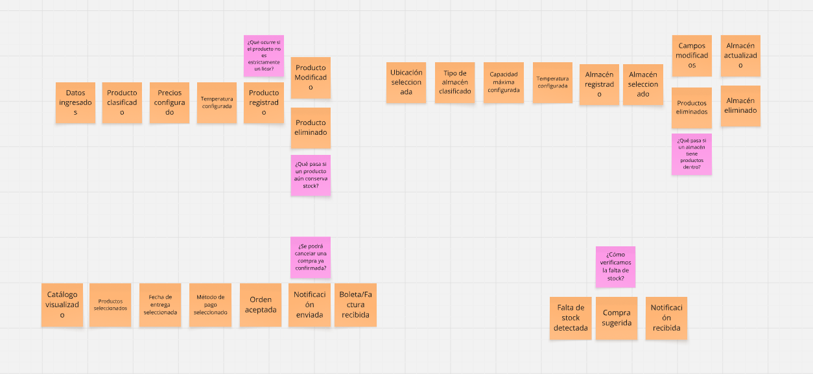

## Paso 4: Pivotal Events

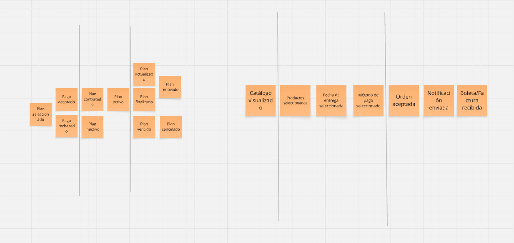

## Paso 5: Commands

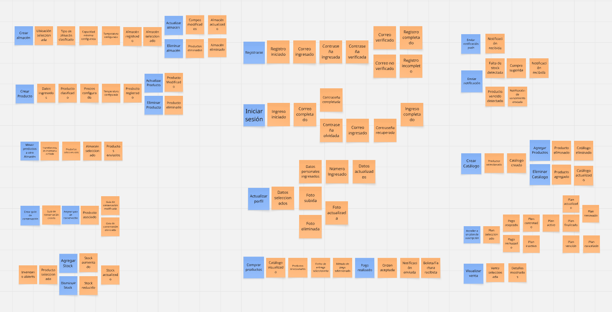

## Paso 6: Policies

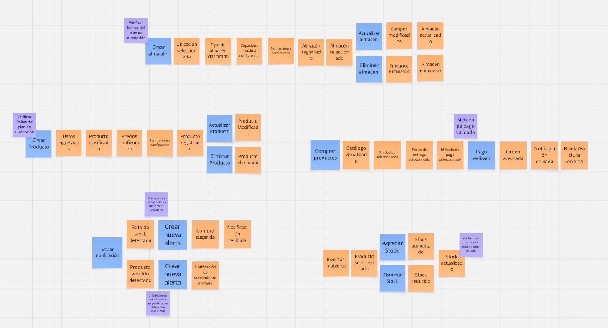

## Paso 7: Read Models

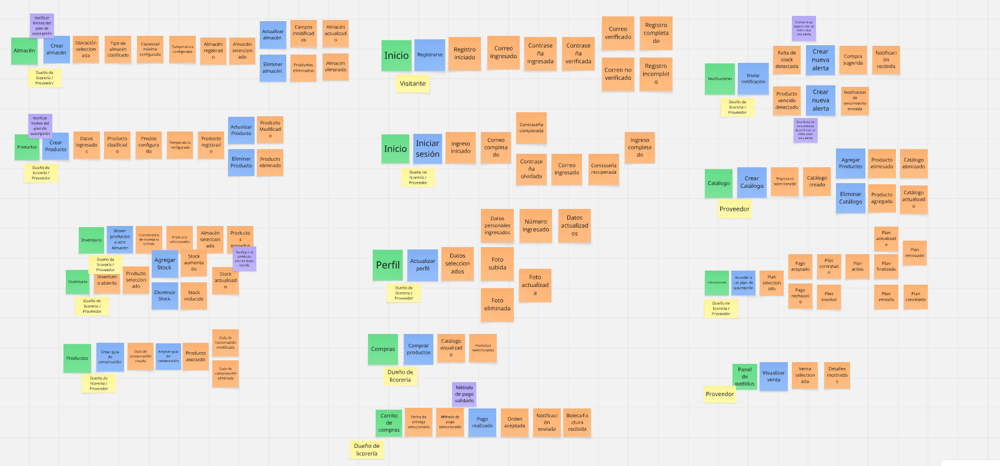

## Paso 8: External Systems

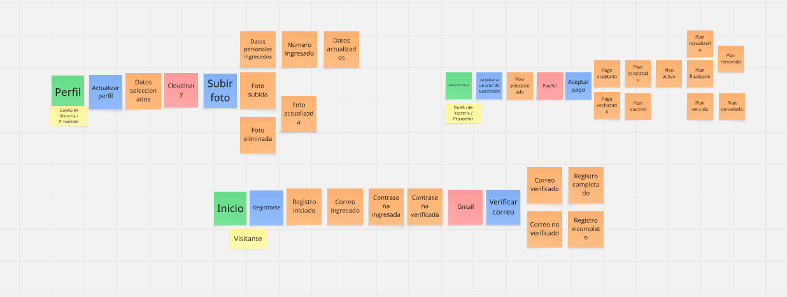

## Paso 9: Aggregates

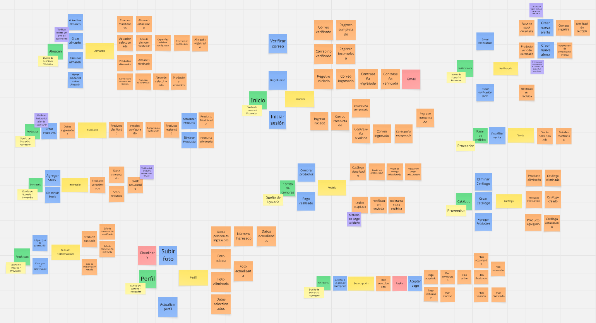

#### 4.1.1.1. Candidate Context Discovery ####

Una vez modelado el dominio mediante Event Storming, el equipo procedió a identificar los bounded contexts candidatos mediante un proceso colaborativo centrado en el valor de negocio y la cohesión del dominio. Para ello, se aplicaron las siguientes técnicas estratégicas:

- **Start-with-value**: Se identificó el área que mayor valor aporta al negocio, enfocándose en los procesos y funcionalidades que impactan directamente en los objetivos estratégicos de la empresa.

- **Start-with-simple**: Se seleccionaron las áreas del dominio que presentan una menor complejidad, facilitando así la implementación y el mantenimiento del sistema.

### 4.1.1.1.1. Inventory Management Context

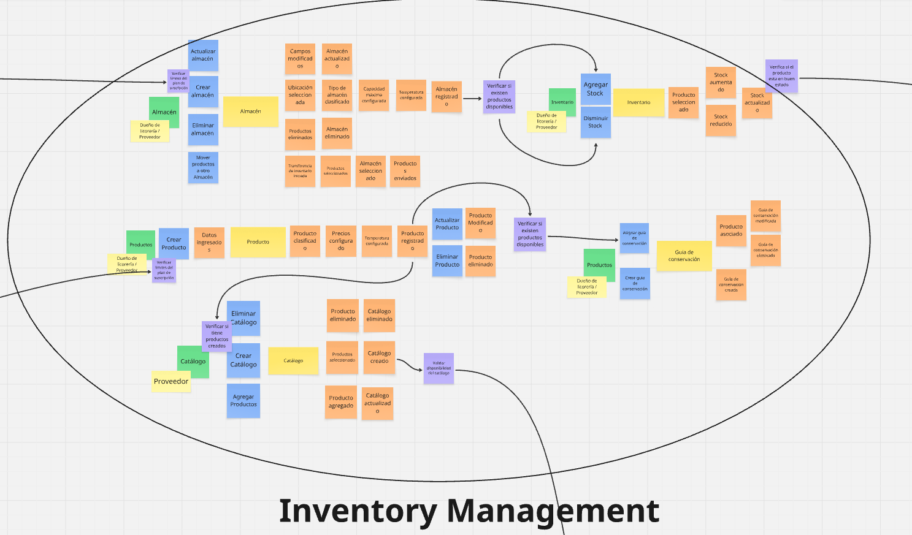

### 4.1.1.1.2 Customer Orders Context

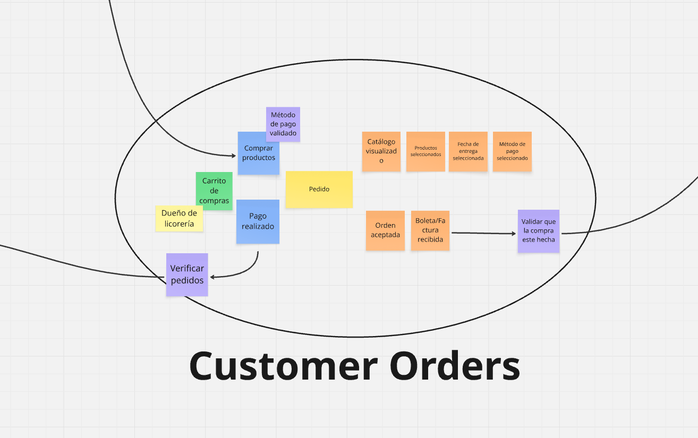

### 4.1.1.1.3 Sales Operation and Management Context

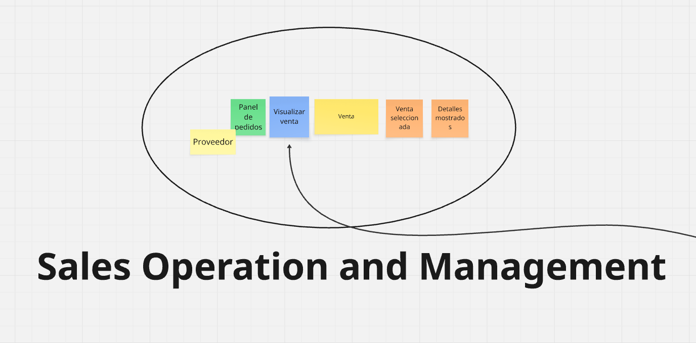

### 4.1.1.1.4 Identity and Access Management Context

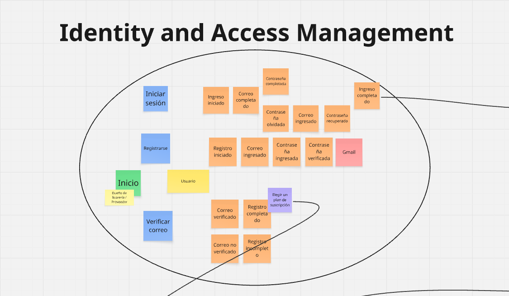

### 4.1.1.1.5 Payments and Subscriptions Context

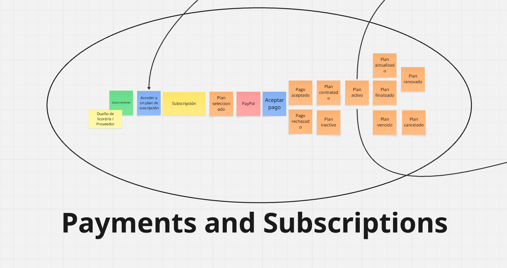

### 4.1.1.1.6 Alerts and Notifications Context

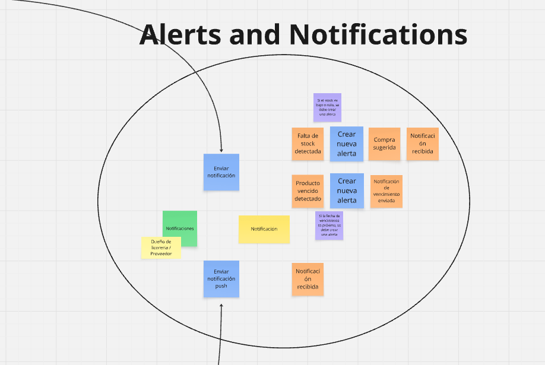

### 4.1.1.1.7 Profiles Management Context

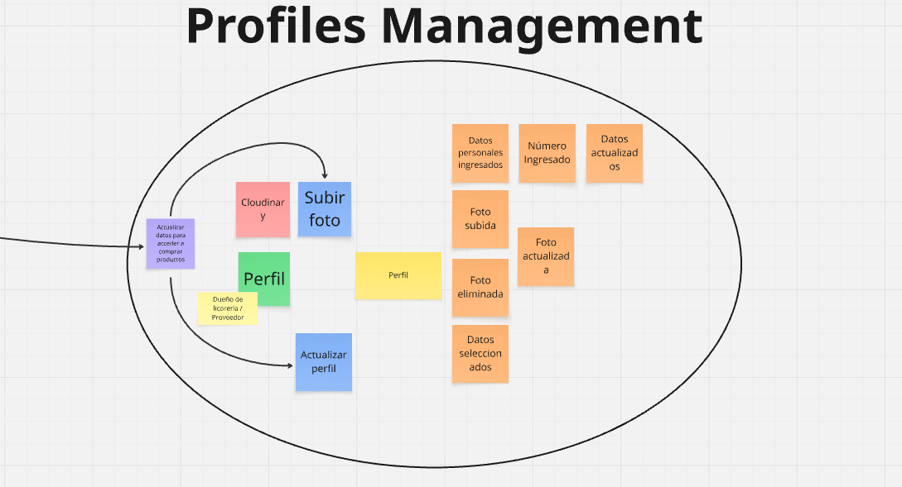