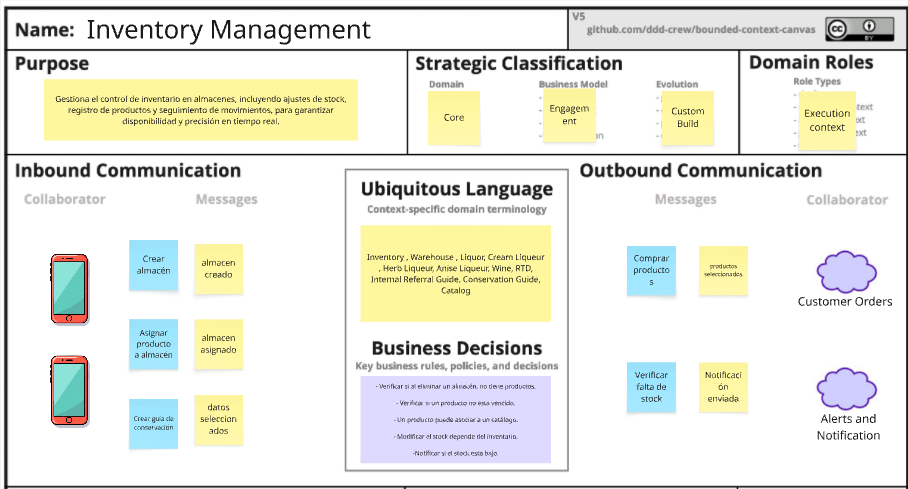
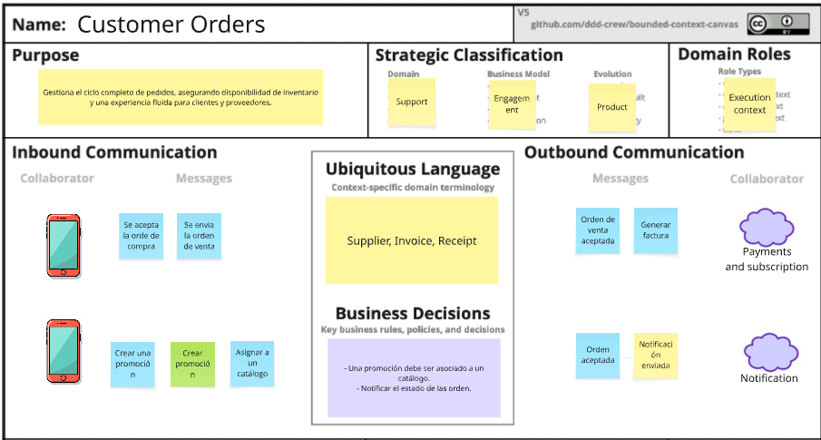
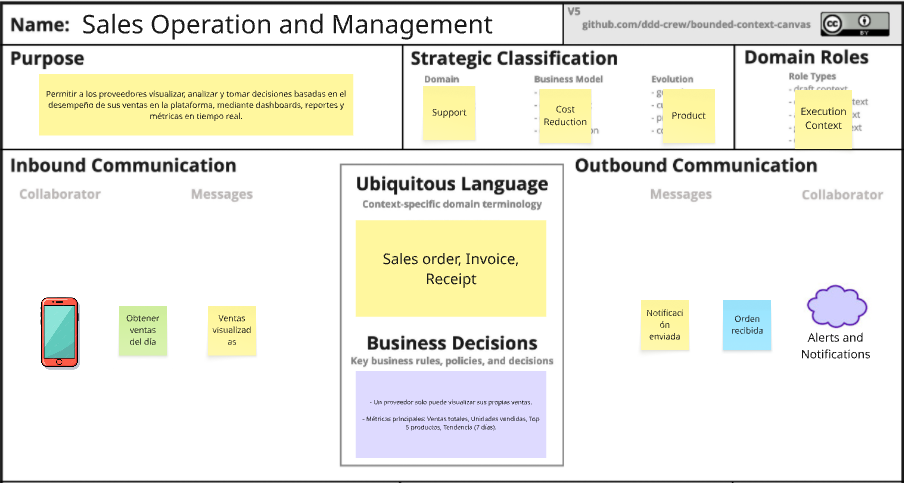
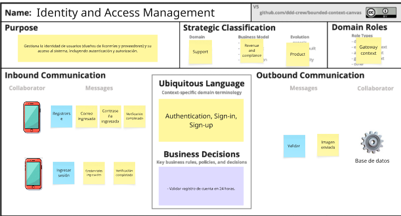
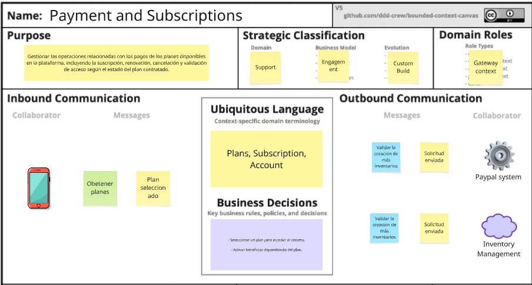
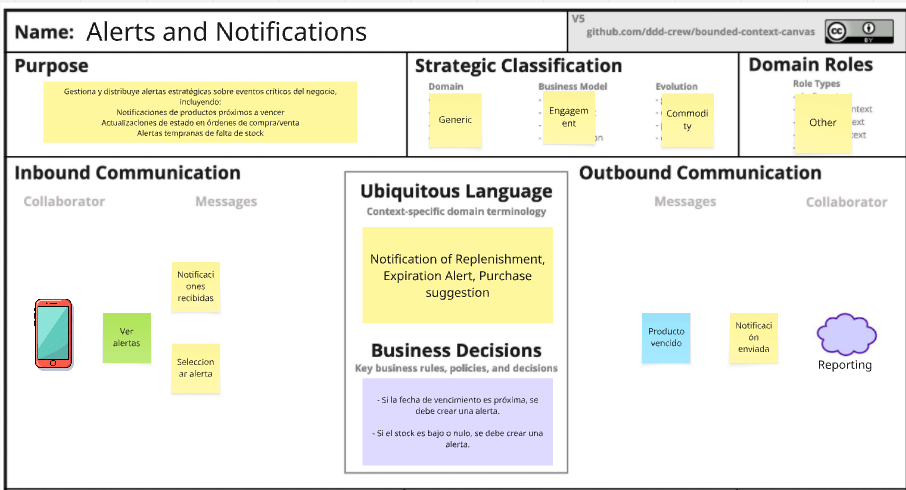
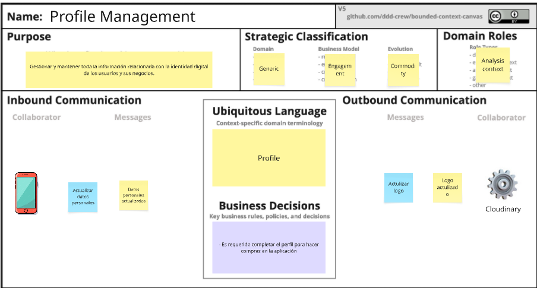

#### 4.1.1.3. Bounded Context Canvases ####

Un bounded context canvas se utiliza para definir los límites de un contexto delimitado y para identificar los elementos clave dentro de ese contexto.

### 4.1.1.3.1. Inventory Management Context - Canvas

Gestiona el control de inventario en almacenes, incluyendo ajustes de stock, registro de productos y seguimiento de movimientos, para garantizar disponibilidad y precisión en tiempo real.

### 4.1.1.3.2. Customer Orders Context - Canvas

Gestiona el ciclo completo de pedidos, asegurando disponibilidad de inventario y una experiencia fluida para clientes y proveedores.

### 4.1.1.3.3. Sales Operation and Management Context - Canvas

Permitir a los proveedores visualizar, analizar y tomar decisiones basadas en el desempeño de sus ventas en la plataforma, mediante dashboards, reportes en tiempo real.

### 4.1.1.3.4. Identity and Access Management Context - Canvas

Gestiona la identidad de usuarios (dueños de licorerías y proveedores) y su acceso al sistema, incluyendo autenticación y autorización.

### 4.1.1.3.5. Payments and Subscriptions Context - Canvas

Gestionar las operaciones relacionadas con los pagos de los planes disponibles en la plataforma, incluyendo la suscripción, renovación, cancelación y validación de acceso según el estado del plan contratado.

### 4.1.1.3.6. Alerts and Notifications Context - Canvas

Gestiona y distribuye alertas estratégicas sobre eventos críticos del negocio, incluyendo:
- Notificaciones de productos próximos a vencer
- Actualizaciones de estado en órdenes de compra/venta
- Alertas tempranas de falta de stock

### 4.1.1.3.7. Profiles Management Context - Canvas

Gestionar y mantener toda la información relacionada con la identidad digital de los usuarios y sus negocios.

