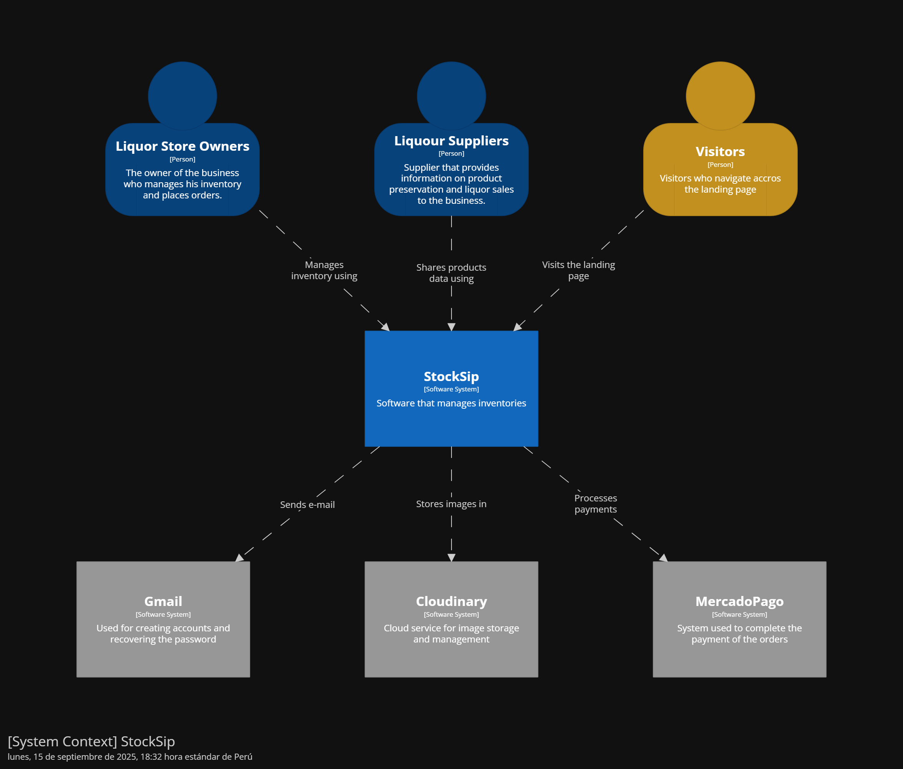

### 4.1.3. Software Architecture ###

#### 4.1.3.1. Software Architecture Context Level Diagrams ####

El diagrama de contexto en la arquitectura de software proporciona una visión general de alto nivel del sistema dentro de su entorno, mostrando cómo interactúa con los actores externos (usuarios, sistemas externos, etc.).

Para StockSip, el diagrama de contexto incluye los siguientes actores y sistemas externos:

