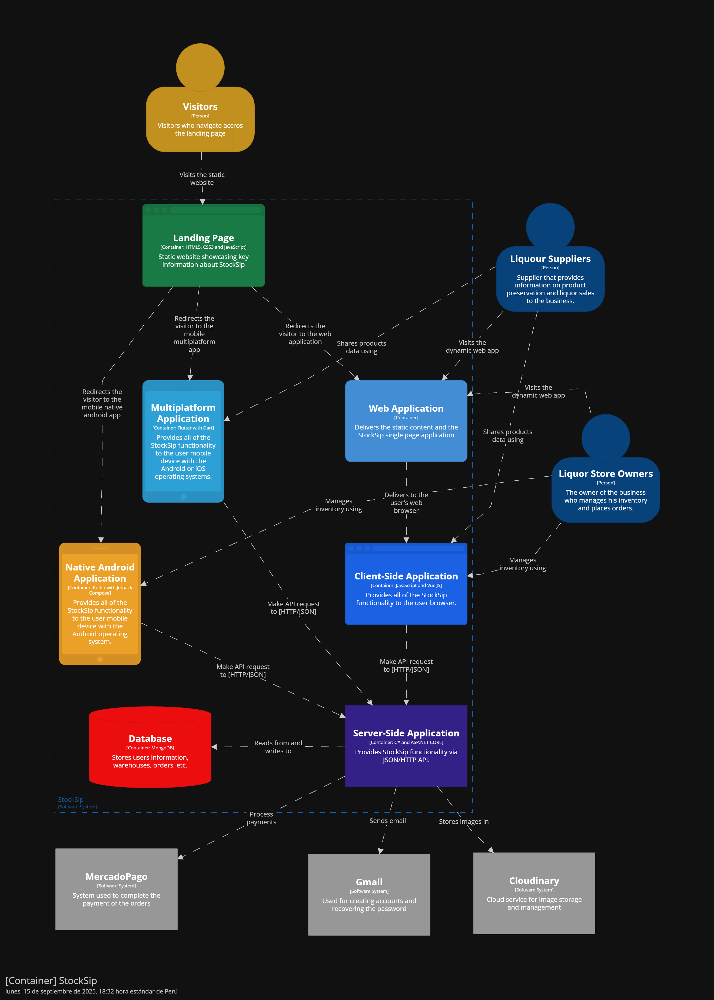

#### 4.1.3.2. Software Architecture Container Level Diagrams ####

El diagrama de contenedores de la arquitectura de software proporciona una visión de alto nivel de los principales contenedores (aplicaciones, servicios, bases de datos, etc.) que componen el sistema y cómo interactúan entre sí.

Para StockSip, el diagrama de contenedores incluye los siguientes contenedores principales:

