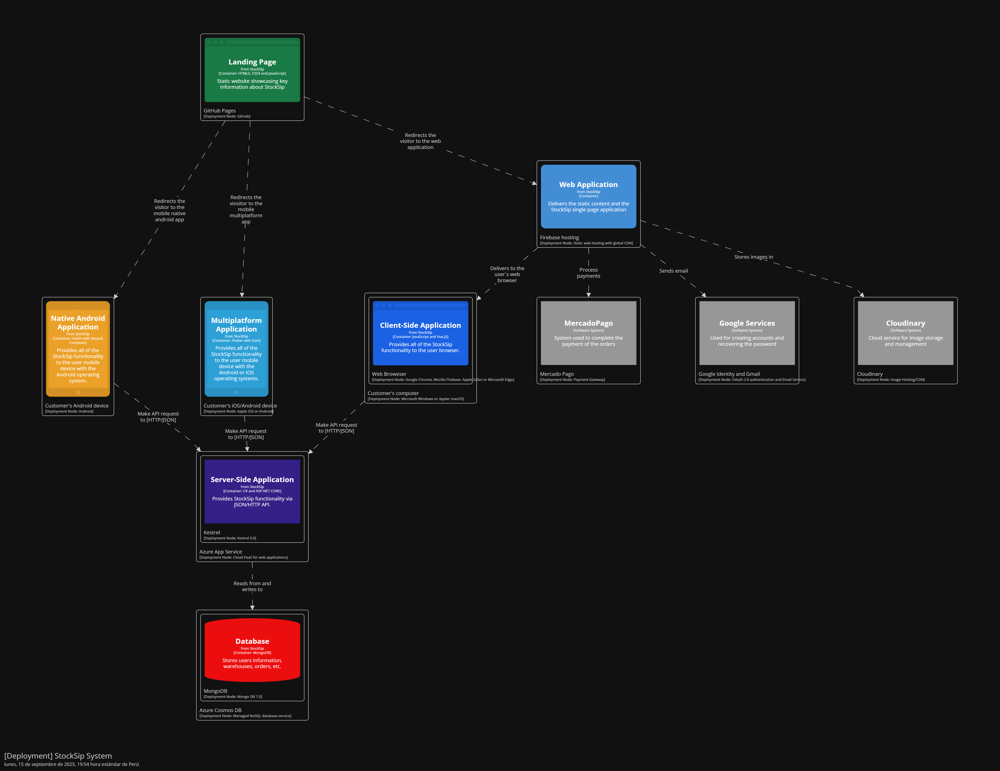

#### 4.1.3.3. Software Architecture Deployment Diagrams ####

El diagrama de despliegue en la arquitectura de software muestra cómo los contenedores del sistema se implementan en la infraestructura física o en la nube, incluyendo nodos, redes y otros componentes de infraestructura.

Para StockSip, el diagrama de despliegue incluye los siguientes nodos y su configuración:

